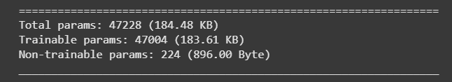
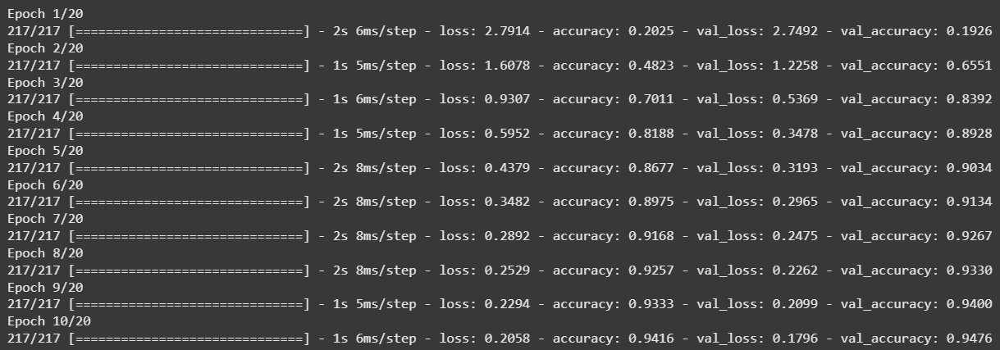
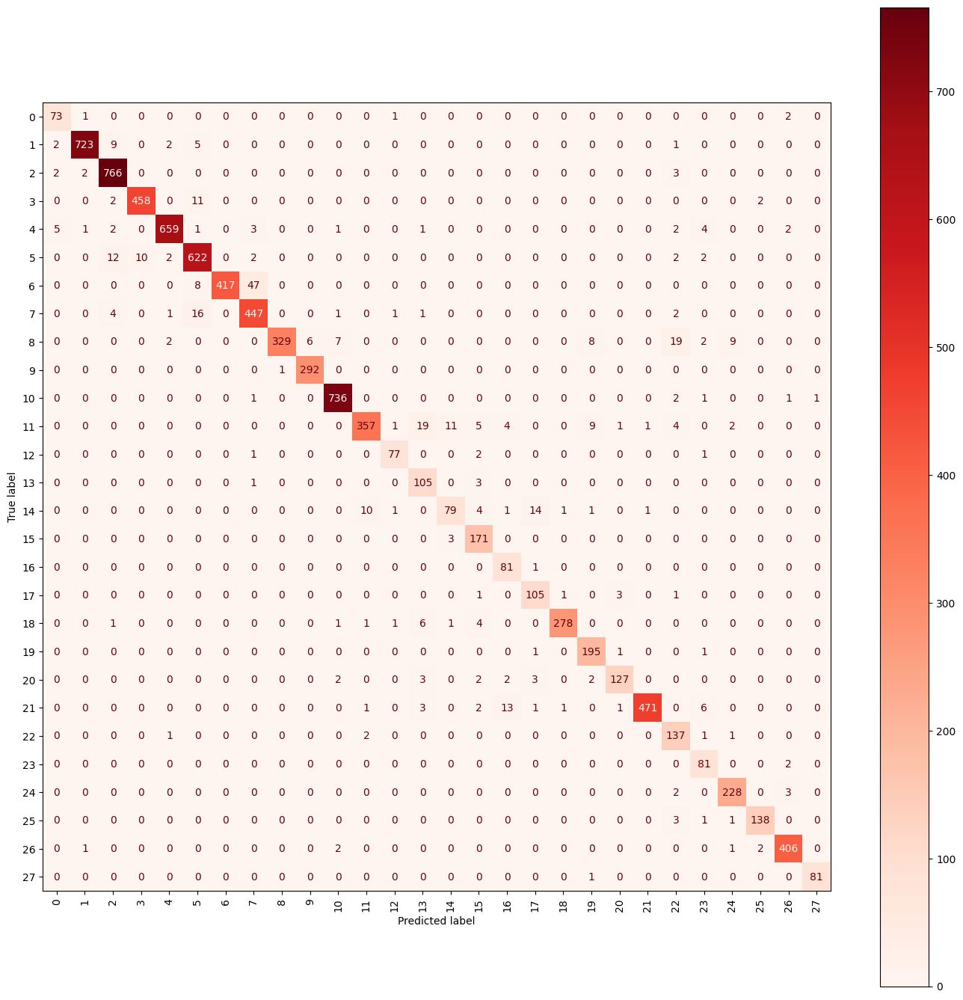

## Project overview

For this project, I developed an intelligent embedded system able to process and interpret data from a driving simulator. The goal was to deploy a traffic-sign recognition model trained on the GTSRB dataset, which contains more than 50,000 images across 43 classes.

The system runs on an ESP32 acting as an HTTP server. Every 100 ms, the simulator sends a 32x32 RGB PNG image together with telemetry data such as speed, odometer, radar and traffic-light information.

Three modes are available: Label predicts the sign class, Managed Speed estimates the speed, and Speed-Break controls virtual acceleration and braking.

## Neural network

I designed a compact convolutional neural network with a target size below 300 KB. It reached approximately 97% accuracy after training, while remaining small enough for an ESP32 with limited memory.

The project involved data preprocessing, model optimisation, post-training quantisation and quantisation-aware training. The final model was deployed as compressed C code for an embedded target.

