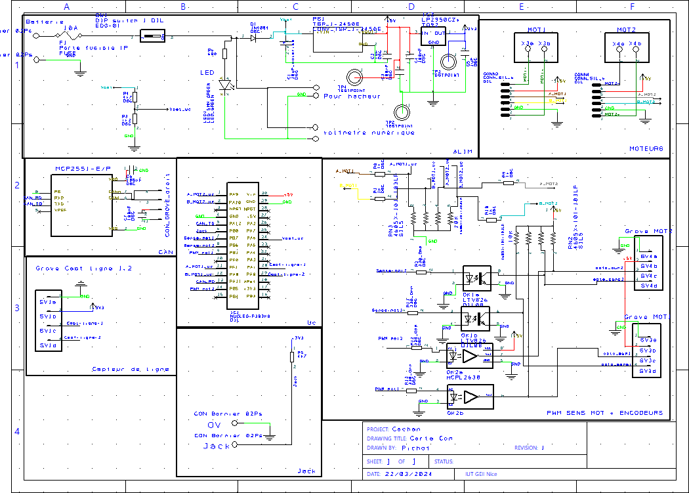

Pendant ma deuxième année à l’IUT de Nice, j’ai participé au projet national de la Rencontre Robotique des IUT GEII. Cet événement regroupe des étudiants de toute la France autour d’un défi commun : concevoir un robot totalement autonome capable de parcourir un terrain rempli d’obstacles, d’un coin à l’autre, sans aucune intervention extérieure. Le projet sur lequel j’ai travaillé s’inscrit dans le cadre du challenge ESCAPEBOT.

## Explication Du projet

Le principe est simple en apparence, mais exigeant sur le plan technique : chaque robot, doit quitter sa zone de départ et rejoindre sa zone d’arrivée située en diagonale, tout en évitant les obstacles de 15 cm de hauteur répartis aléatoirement sur le terrain. Le terrain, d’une surface de 8 m sur 8 m, est conçu pour que les parcours soient équivalents pour tous les robots.


_Terrain_

Afin d’aider à la localisation, chaque robot peut s’appuyer sur un maximum de trois balises disposées aux coins et bords du terrain. Les balises doivent respecter des contraintes de taille, de sécurité (notamment pour les émissions lumineuses ou sonores) et d’autonomie en énergie selon leur emplacement. Le départ se fait par un retrait de prise jack, et le robot a un maximum de 90 secondes pour atteindre sa zone. Pour valider son arrivée, il doit s’immobiliser et faire éclater un ballon. Le système de points attribués dépend du comportement du robot (démarrage autonome, arrivée, classement) et incite à concevoir un système fiable, rapide et intelligent. Ce projet m’a permis de mettre en œuvre de nombreuses compétences en électronique, programmation, traitement de capteurs et impression 3d. C’est aussi un projet riche en collaboration, car il requiert coordination et échanges avec mes camarades.

## Mes missions dans le projet

J’ai réalisé l’intégralité des pièces du robot en impression 3D, de la conception à la fabrication. J’ai aussi conçu seul la carte IHM, qui permet à l’utilisateur d’interagir avec le robot. Enfin, j’ai travaillé en binôme avec Mathis sur la carte commande : j’ai réalisé le schéma électronique pendant qu’il s’est chargé du routage du PCB et de la programmation associée. Ces tâches m’ont permis de développer mes compétences techniques en électronique et en conception, tout en collaborant efficacement sur un projet d’envergure.

## Carte commande

Pour la carte commande, ma mission principale a été de concevoir le schéma électronique en intégrant plusieurs éléments clés : la gestion de la batterie, les encodeurs, les connecteurs pour les moteurs, le jack de démarrage, la mesure de la tension batterie, ainsi que les connecteurs pour les capteurs de ligne. J’ai travaillé à partir de la carte de première année, en l’adaptant aux besoins spécifiques de ce projet. Cela a notamment impliqué la modification du microcontrôleur, en remplaçant le mbed KL25z par un STM32 Nucleo, plus adapté aux contraintes et fonctionnalités attendues. Cette évolution a permis de mieux répondre aux exigences du challenge tout en conservant une base fonctionnelle solide.



## Carte IHM

J’ai conçu une carte IHM pour permettre à l’utilisateur de communiquer avec le robot. Ma mission principale a été d’intégrer un servomoteur MG995, utilisé pour éclater un ballon à la fin du parcours, commandé par un signal PWM. J’ai également installé trois LEDs et trois boutons.

J’ai aussi intégré un écran LCD TFT ST7735 de 1,8 pouce, avec une résolution de 128 x 160 pixels, connecté au microcontrôleur Nucleo F303k8 via SPI. Pour le rétroéclairage, j’ai configuré le contrôle PWM en mode direct. J’ai programmé l’écran avec une bibliothèque mbed spécifique, permettant l’affichage de texte, la gestion de la luminosité et le dessin de formes géométriques.

Enfin, j’ai implémenté l’affichage d’images au format RGB565 après conversion avec un script Python, tout en respectant la limite mémoire de la carte. La communication avec le robot se fait via le bus CAN à l’adresse 0x103.


_Schématique carte IHM_

_PCB carte IHM_

Code Carte IHM

```cpp

#include "CANMsg.h"
#include "image.h"
#include "lcd_base.h"
#include "mbed.h"
#include "st7735.h"

// Constante
#define PERIOD 0.01 // periode

// Déclaration
ST7735_LCD lcd(A3, A2, A0, A4, A6, A1, Direct, 20); // cs, reset, dc, scl, sda, bl
CAN can(D10, D2); // CAN Rx pin name, CAN Tx pin name
Serial pc(USBTX, USBRX);
CANMsg rxMsg;
CANMsg txMsg;

// Gere les servomoteurs
PwmOut servo1(PA_9);
PwmOut servo2(D11);

// Bus de bits des entrées/sorties
BusOut myled(PB_0, PA_10, PB_6);
DigitalIn bus_bp(PB_1);

// Gestion des interruptions
Ticker tic;

// Variables globales Bus CAN
const unsigned int ID_CARTE_COMMANDE = 0x100; // id carte commande
const unsigned int ID_CARTE_IHM = 0x103;       // id carte ihm

uint8_t etat_led1 = 0, etat_led2 = 0, etat_led3 = 0, etat;
uint8_t bp = 0;

// Variables globales Main
bitmap_t myImage;
int flag_led = 0;
char mess[20];

// Initialisation des fonctions
void Init(void);
void inverse_led();
void onCanReceived(void);
void send_message_to_commande(void);
void affichage_lcd();

// Début du Main
int main() {
    Init();
    affichage_lcd();

    // Début de la boucle infinie
    while (1) {
        bp = bus_bp.read();
        pc.printf("%d \r", bus_bp.read());
        sprintf(mess, "bp= %d", bp);
        lcd.Print(mess, LEFT, 25, COLOR_YELLOW, COLOR_BLACK); // align text to center horizontally

        affichage_lcd();

        servo1.pulsewidth_ms(1);
        servo2.pulsewidth_ms(1);
        wait(0.5);
        servo1.pulsewidth_ms(2);
        servo2.pulsewidth_ms(2);
        wait(0.5);
    }
}

void Init(void) {
    // Fixation de la vitesse de transmission des ports séries
    pc.baud(9600);               // set serial speed
    can.frequency(1000000);      // set CAN bit rate to 1Mbps

    // Filtrage BUSCAN
    can.filter(ID_CARTE_COMMANDE, 0xFFF, CANStandard, 0); // que les messages de la carte commande interviennent
    can.attach(onCanReceived);                             // attach ISR to handle received messages

    bus_bp.mode(PullNone); // Pinmode

    // Structure de la variable myImage
    myImage.Width = image_width;
    myImage.Height = image_height;
    myImage.PixelData = image_data;

    // Interruption des timers
    tic.attach(&inverse_led, 1); // inverse l'état des leds toutes les secondes

    // Initialisation des périodes à 20ms
    servo1.period_ms(20);
    servo2.period_ms(20);
}

void inverse_led() {
    flag_led = !flag_led;
    if (flag_led == 0)
        myled.write(7);
    else
        myled.write(0);
}

void onCanReceived(void) {
    can.read(rxMsg);
    if (rxMsg.id == ID_CARTE_COMMANDE) {
        // extract data from the received CAN message
        // in the same order as it was added on the transmitter side
        rxMsg >> etat_led1;
        rxMsg >> etat_led2;
        rxMsg >> etat_led3;
    }
}

void send_message_to_commande(void) {
    bp = bus_bp.read();
    txMsg.clear();           // clear Tx message storage
    txMsg.id = ID_CARTE_IHM; // set ID
}


```

## Impression 3d
