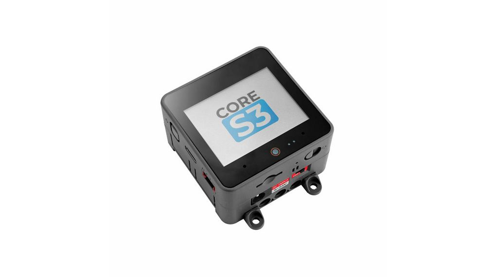
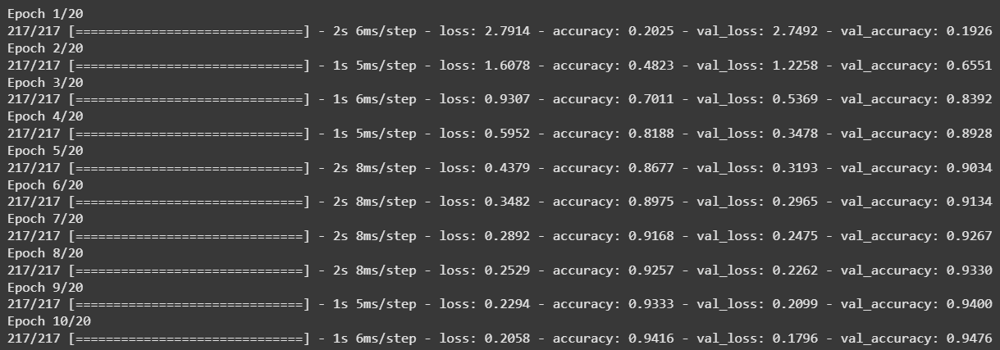
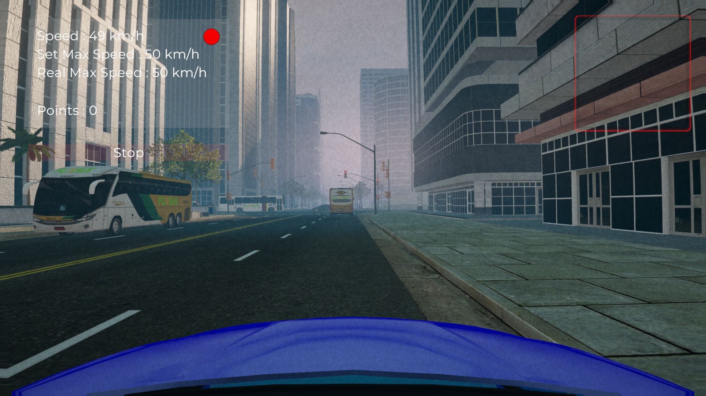

# Explication Du projet

Dans le cadre de ma troisième année à l’IUT de Nice en spécialité Électronique des Systèmes Embarqués (ESE), j’ai participé au projet SIMIA, visant à développer un système embarqué intelligent capable de traiter et d’interpréter des données d’un simulateur de conduite. L’objectif était de mettre en œuvre un modèle d’IA de reconnaissance de panneaux de signalisation à partir du jeu de données GTSRB, composé de plus de 50 000 images réparties en 43 classes. Une attention particulière a été portée au prétraitement des données (normalisation, encodage, gestion des valeurs manquantes) et à l’optimisation des modèles via des techniques de compression, comme la quantification post-entraînement et la quantization-aware training.

Le système cible tournait sur un microcontrôleur ESP32, qui jouait un rôle central en tant que serveur HTTP recevant des images et données du simulateur Unity. Trois modes de fonctionnement étaient proposés : le mode Label, qui prédisait uniquement la classe du panneau ; le mode Managed Speed, qui renvoyait une estimation de la vitesse ; et le mode Speed-Break, où l’ESP32 contrôlait directement l’accélération et le freinage virtuels. Chaque 100 ms, une image PNG RGB 32×32 était transmise à l’ESP32, accompagnée de données de télémétrie (vitesse, odomètre, radar, feu rouge). L’ESP32 devait alors renvoyer une réponse formatée, selon le mode actif.



# Modèle du Réseau de Neurones

J’ai conçu un modèle aussi compact que possible tout en conservant un niveau de précision satisfaisant (environ 95 %). L’objectif était d’atteindre un bon compromis entre performance et taille mémoire, afin de pouvoir l’embarquer sur une carte à ressources limitées comme l’ESP32.

```python
model = Sequential()
model.add(Input(shape = (32, 32, 3)))
model.add(Conv2D(16, (5, 5), activation = 'relu'))
model.add(BatchNormalization())
model.add(MaxPooling2D(pool_size = (2,2)))

model.add(Conv2D(32, (3, 3), activation = 'relu'))
model.add(BatchNormalization())
model.add(MaxPooling2D(pool_size = (2, 2)))

model.add(Conv2D(64, (3, 3), activation = 'relu'))
model.add(BatchNormalization())
model.add(MaxPooling2D(pool_size = (2, 2)))

model.add(Dropout(0.5))

model.add(Flatten())
model.add(Dense(64, activation = 'relu'))
model.add(Dense(64, activation = 'relu'))
model.add(Dropout(0.5))
model.add(Dense(28))

model.add(Activation('softmax'))
```

Le modèle ci-dessus comprend trois couches convolutives suivies de normalisation, de sous-échantillonnage (MaxPooling) et de deux couches fully-connected avec dropout pour éviter le surapprentissage. Ce réseau a été spécifiquement conçu pour rester compact, tout en maintenant une bonne capacité d'apprentissage.

L’image suivante montre un aperçu du modèle obtenu, tel qu’il est affiché dans l’interface de visualisation :


Ce schéma permet de vérifier la structure du réseau, le nombre de paramètres par couche, ainsi que l’enchaînement des opérations. Il montre que le modèle reste léger en profondeur, mais exploite plusieurs couches convolutives efficaces pour l’extraction des caractéristiques.

Comme le modèle est destiné à être embarqué dans une carte ESP32, nous devions limiter sa taille mémoire. L’ESP32 dispose de 16 Mo de mémoire flash et 8 Mo de PSRAM, ce qui est suffisant pour des modèles simples, mais impose une contrainte stricte.
Nous avons donc fixé une taille maximale de modèle à 300 Ko sur Google Colab.

Pour atteindre une précision suffisante, j’ai ajusté les hyperparamètres (batch size, taux d’apprentissage, structure, etc.) et effectué plusieurs séries d'entraînement.
Après environ 10 époques, le modèle atteint une précision de 93 %, ce qui est excellent pour un réseau aussi compact. J'ai continué à faire des époques pour un total de 20 époques pour avoir 97% de précision.




Le graphique ci-dessus montre la progression de l’apprentissage. On constate une convergence rapide et une stabilisation des performances sans surapprentissage notable, signe que le modèle est bien équilibré.

Enfin, pour évaluer les performances réelles sur l’ensemble de test, j’ai généré la matrice de confusion suivante :


Elle permet d’analyser les prédictions correctes (diagonale) ainsi que les erreurs commises entre classes. La répartition homogène et le faible taux d'erreurs confirment la fiabilité du modèle, même avec un nombre limité de paramètres.

# Missions

Nous avons utilisé Qualia, un framework conçu pour optimiser et déployer des modèles de deep learning sur des dispositifs embarqués. Il permet notamment de convertir un modèle Python en code C fortement compressé, grâce à des techniques de quantification et de gestion mémoire adaptées aux contraintes matérielles.Cela nous a permis d’intégrer notre modèle sur une carte ESP32. Apres cela fait nous avons du connecter le simulateur avec l'ESP32



A partir d’un squelette fourni, avec pour objectif la reconnaissance de trois panneaux routiers.


Une autre mission du projet consistait à décoder un payload de 32 bits envoyé par un simulateur. Ce payload contenait plusieurs informations (vitesse, distance parcourue, présence d’obstacle, détection de feu rouge), que l’ESP32 recevait via une interface HTTP. Après traitement, nous devions renvoyer notre propre payload structuré, également sous la forme d’un entier 32 bits.

réception des images :

```cpp
void handleImageRequest(AsyncWebServerRequest *request, uint8_t *data, size_t len, size_t index, size_t total) {
  Serial.printf("Receiving image data: %d/%d\n", receivedSize, totalSize);
  if (index == 0) {
    StartTime = micros();
    receivedSize = 0;
    totalSize = total;

    if (waitforinference) {
      Serial.println("Inference en cours, image ignorée");
      return;
    }
    memset(image, 0, 2048);
  }

  // Copie des données reçues dans le buffer image global
  memcpy(&image[index], data, len);
  receivedSize += len;

  if (receivedSize >= totalSize) {
    int rc = png.openRAM(image, totalSize, PNGDraw);

    if (rc == PNG_SUCCESS) {
      rc = png.decode(NULL, PNG_FAST_PALETTE);
      if (rc == 0) {
        ready = true;
        request->send(200, "text/plain", "OK");
      }
    }
  }
}
```

softmax : La fonction softmax est utilisée pour transformer les sorties brutes du réseau de neurones en probabilités interprétables. Chaque sortie représente un score associé à une classe (dans ce cas, un type de panneau routier), mais ces scores ne sont pas normalisés. Le softmax applique une exponentielle sur chaque score, puis divise chaque valeur par la somme des exponentielles, ce qui permet d’obtenir des valeurs entre 0 et 1, dont la somme est égale à 1. Cela permet ainsi de déterminer la classe la plus probable en choisissant celle avec la plus haute probabilité. Dans ce projet, cette opération est essentielle pour identifier correctement le panneau détecté par le modèle déployé sur l’ESP32.

```cpp
// SOFTMAX
float sum = 0;
float max_val = outputs[0];
for (int i = 1; i < FC_UNITS; i++) {
  sum += exp(outputs[i]/100);
  if (max_val < outputs[i]) {
    max_val = (float)outputs[i];
    label = i;
  }
}
```

Fonctionnement :

- Réception d’une image via l’endpoint /image (format PNG, 32×32 pixels, RGB)

- Réception des données via /data : speed, odometer, carinfront, redlight

- Traitement des données, puis renvoi d’un payload encodé sur 32 bits

Voici le code pour décoder les informations du décodeur

```cpp
#include <Arduino.h>
#include <stdint.h>

// Structure to hold the unpacked car data
struct CarData {
    int speed;       // Speed in XXX.XX * 100
    int odometer;    // Odometer in XXX.XX * 100
    bool redlight;   // Red light indicator
    int carInFront; // Car in front indicator
};

// Fonction pour déballer un tableau de 4 octets en données de voiture
CarData unpackCarData(const uint8_t* data) {
    if (data == nullptr) {
        Serial.println("Error: Null data pointer!");
        return {0, 0, false, false};
    }

    // On combine les 4 octets en un seul entier
    uint32_t packedData = (data[0] << 24) | (data[1] << 16) | (data[2] << 8) | data[3];

    // Extraction des valeurs
    CarData carData;
    carData.speed = (packedData >> 24) & 0xFF;
    carData.odometer = (packedData >> 8) & 0xFFFF;
    carData.carInFront = (packedData >> 1) & 0x7F;
    carData.redlight = packedData & 0x1;

    return carData;
}
```
