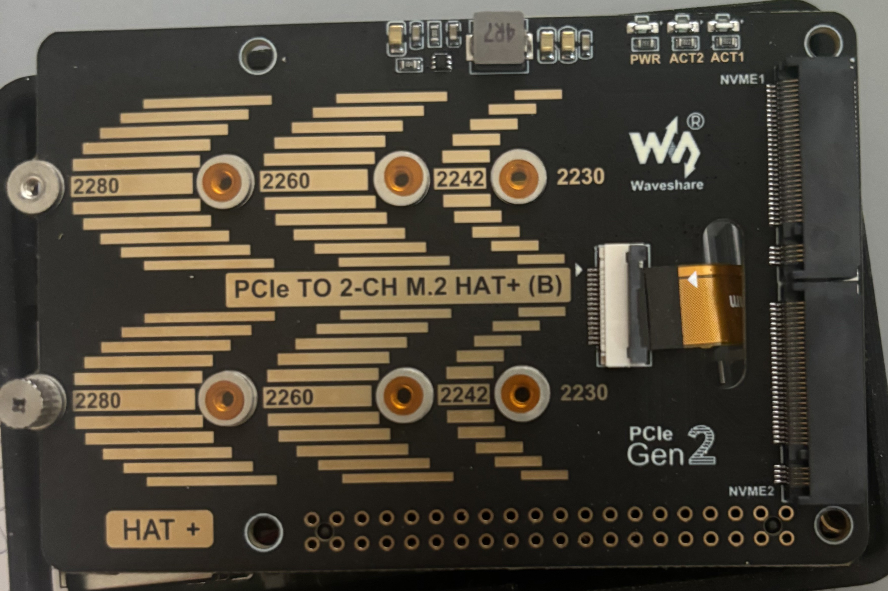
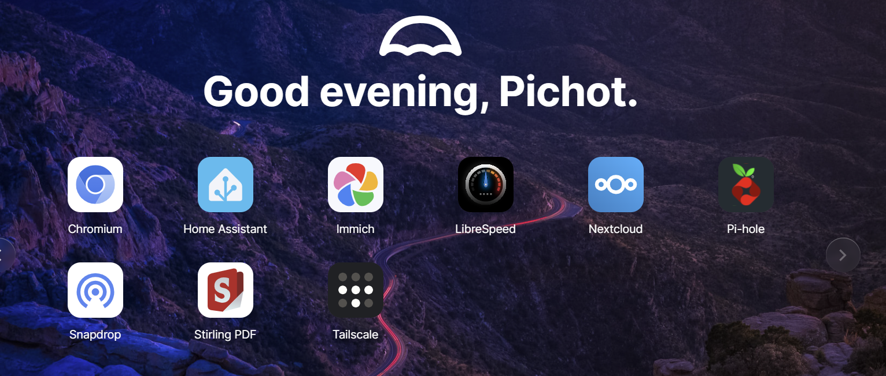
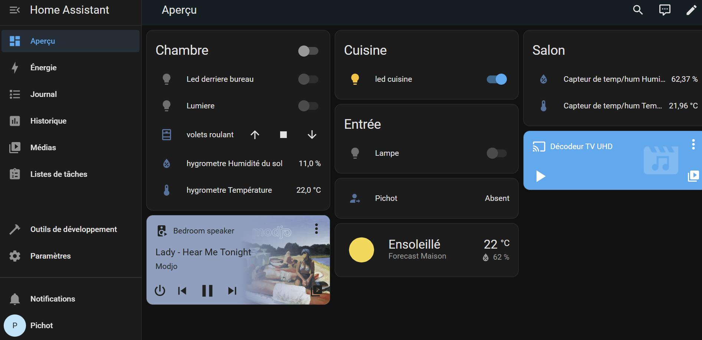
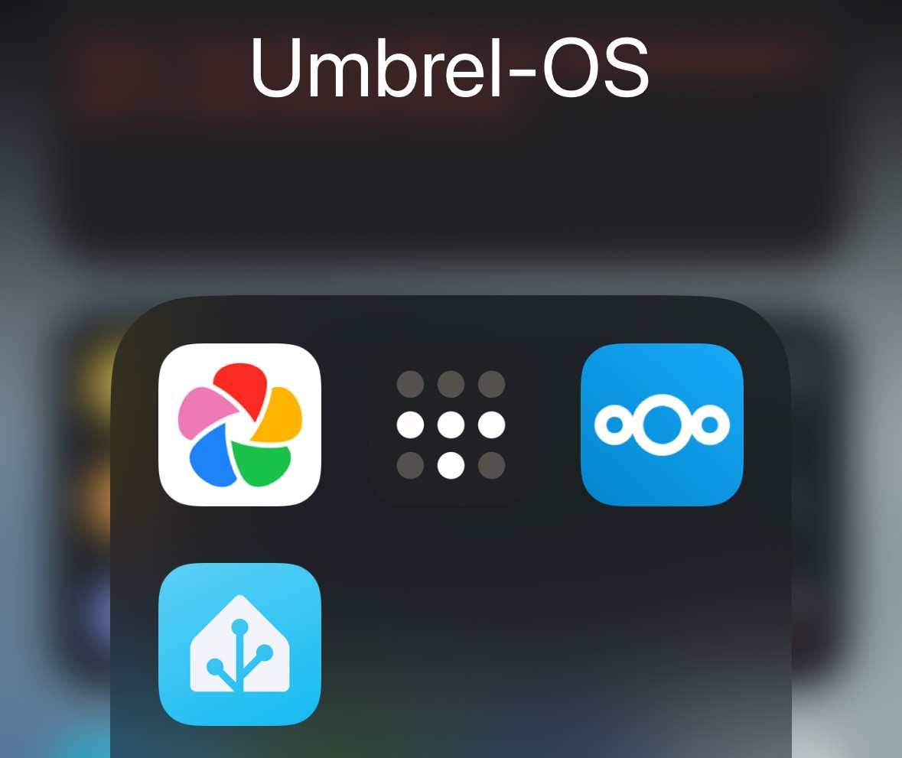

# Home Assistant, un indispensable de la domotique ?

Depuis quelques années, Home Assistant s'est réellement imposé parmi les environnements domotiques. Son efficacité, sa compatibilité et son énorme communauté la propulsé devant d'autres solutions open source comme Jeedom.

Ayant essayé Home Assistant il y a quelques mois maintenant, je me suis rendu compte que l'intégralité de mon installation domotique était compatible, mais également que de nouveaux appareils pouvaient y être intégrés. Il me restait plus qu'à configurer une solution propre et durable au sein de Home Assistant.

# Technologie utulisé

J'ai intallé umbrel-OS sur ma raspberry pi 5 avec un hat PCIe to 2-CH M.2 qui peux aqueir 2 SSD. Sur la rp 5 j'ai mit une clée zigbee car mes équipements communiques en zigbee

# Umbrel-OS

Umbrel OS est un système d’exploitation libre basé sur Linux, conçu pour transformer un petit ordinateur (comme un Raspberry Pi) en un serveur personnel auto-hébergé. Il permet d’installer et de gérer facilement des applications décentralisées, comme des nœuds Bitcoin, des outils de cloud privé (type Nextcloud), des gestionnaires de mots de passe, ou encore des services de messagerie chiffrée.

Son interface web intuitive rend l'installation d'apps aussi simple que sur un smartphone. Umbrel met l’accent sur la confidentialité, la sécurité et la souveraineté numérique, en permettant à chacun d’héberger ses données chez soi, sans dépendre de services cloud centralisés.

_Mon interface_

# Application

## Home assistant

J’ai installé Home Assistant via Umbrel OS. Cependant, comparé à mon ancienne installation native sur Raspberry Pi, certaines fonctionnalités clés sont absentes. Notamment, l’interface Supervisor n’est pas disponible, ce qui limite l’accès aux add-ons officiels. Lors de mon installation native, j’avais pu connecter mon Google Home pour contrôler ma domotique à la voix, et intégrer le thème Mushroom pour créer un Dashboard épuré et personnalisé, ce qui n’est pas possible dans la version Umbrel.

### Dashboard

J'ai crée mon propre Dashboard sur Home Assistant

## Immich

Immich est une application libre qui permet de stocker, organiser et sauvegarder automatiquement mes photos et vidéos, comme Google Photos, mais en local chez moi.

## Next cloud

Nextcloud est une alternative libre à Google Drive qui te permet de stocker, partager et synchroniser mes fichiers sur ton propre serveur. Vu qu'il est hébergé chez moi, je garde le contrôle total sur mes données.

## Tail scale

J’ai également installé Tailscale, un outil qui permet de créer facilement un réseau privé sécurisé (VPN) entre plusieurs appareils, même s’ils ne sont pas connectés au même réseau Wi-Fi. Grâce à lui, je peux accéder à distance à mon serveur Umbrel comme s’il était sur le même réseau local, et ainsi utiliser toutes les applications installées sur Umbrel OS.

Tailscale utilise le protocole WireGuard, à la fois rapide et sécurisé. Il ne nécessite presque aucune configuration et traverse automatiquement les pare-feux et les NAT. C’est une solution très pratique pour accéder à mes services auto-hébergés depuis n’importe où, sans avoir à ouvrir de ports sur sa box.

_Voici les applications sur mon télephone_

# La suite ?

Il me reste encore à intégrer mon compteur Linky, mon système d’arrosage automatique et mon imprimante 3D. Je souhaite également connecter mon Google Home à Home Assistant. Pour cela, je dois encore approfondir le sujet afin de mettre en place une solution concrète et fonctionnelle.
